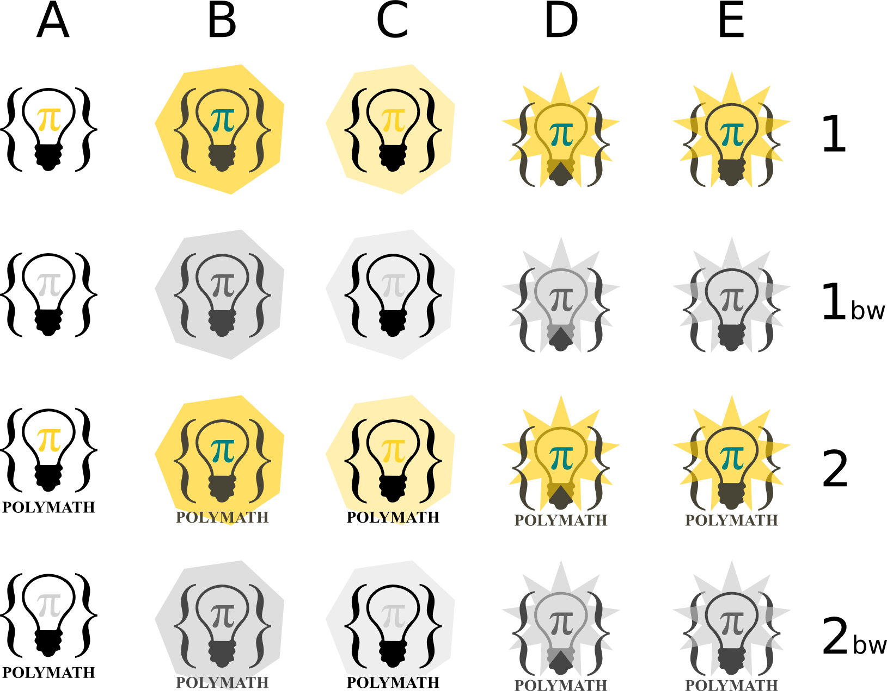

Variation on a theme
==============

Proposal for a logo for the [PolyMath](http://michaelnielsen.org/polymath1/) project.

Each icon is vectorial (made with Inkscape) and presented both in color and black and white version (useful to see how it appears when printed).
Here you can see all of them:

They are released in the Public Domain under [CC0 - “No Rights Reserved”](http://creativecommons.org/about/cc0).

